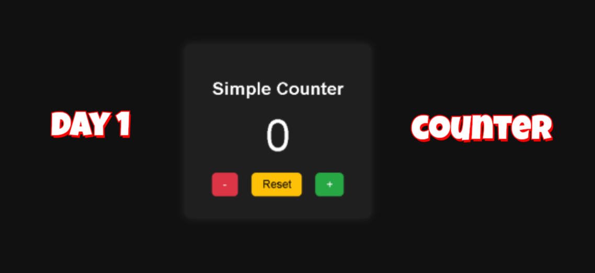

# 100 Days 100 JavaScript Projects 💯 
## Day 1 - Simple Counter
## 📸 Preview

Hi! I'm Sneka and this is my journey of building  
**100 simple JavaScript projects in 100 days**.

Each day, I’ll post one fun, beginner-friendly project  
using only **HTML, CSS, and JavaScript** — no frameworks!

---

## 🚀 Projects

- **Day 1** → Simple Counter [✔️]
- **Day 2** → Coming soon...
- ...
- **Day 100** → Final Project

---

## 📺 Watch on YouTube

Follow along on my channel:  
[Subscribe Here](https://www.youtube.com/@Webdevelopmentprojects-l3v)

---

## 🔗 Connect With Me

- GitHub: [snekaC2024](https://github.com/snekaC2024)  
- LinkedIn: [Sneka Chandrasekaran](https://linkedin.com/in/sneka-chandrasekaran)

---

**#100DaysOfCode #JavaScript #SnekaJS100**
